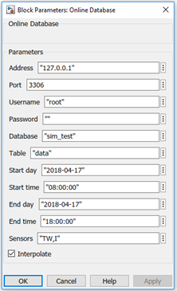
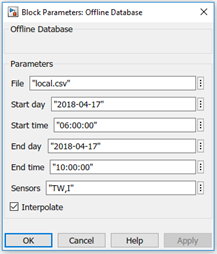

# SimDatabase
A MySQL extension for Simulink.

## Online mode



The Online database block uses a MySQL server to generate the desired output data, this is achieved by a custom dynamic link library (dll) file. This library was written in C using the **MySQL Connector C API version 6.1.11**.

The block can interpret a predefined format of SQL entry:

| date        | time     | data                 |
|:-----------:|:--------:|:--------------------:|
| YYYY-MM-DD  | hh:mm:ss | N1=v1;N2=v2;N3=v3; … |
| ...  		    |  ...     | ...                  |       

This way a specified number of *vs* can be extracted from the database for the given *Ns* based on the time interval.

The precision required for the simulation is, currently, achieved by linear interpolation, which can be turned off.

The connection and the query take a long time compared to the other operations. To solve this problem the block saves the results in a unique file and only uses the database when this file does not exist, otherwise reads the data from the file, which takes significantly less time.

See ```test_matlabfcn_online.slx```

## Offline mode



The Offline database block uses a file to output the measured data. The Simulink program has no easy built-in support for custom text file handling, so this is achieved by the same .dll file used in the Online database block.

The block can interpret a predefined format of file entry:
```
Date;Time;N1;N2;N3;N4...
YYYY-MM-DD;hh:mm:ss;v1;v2;v3;v4...
```
This format can be easily exported from an Excel table using CSV export.

The precision required for the simulation is, currently, achieved by linear interpolation, which can be turned off.

See ```test_matlabfcn_offline.slx```

## Requirements
- MATLAB R2018a + Simulink (trial can do the trick)
- Visual Studio 2017 Community Edition (free)

## Compilation
Use (and modify) ```compile_and_run.m```

## Usage
Copy ```simdatabase.dll``` and ```resolve_pointer.m``` to the **Working Directory** and follow the examples.

## Notes
- The ```simdatabase_step_x()``` functions have **10** outputs.
- Tested on Windows 10 x64.
- Can be ported to Linux (```mex()``` will be different).

## License
Use, modify as you wish, just mention me in your README ;) 
