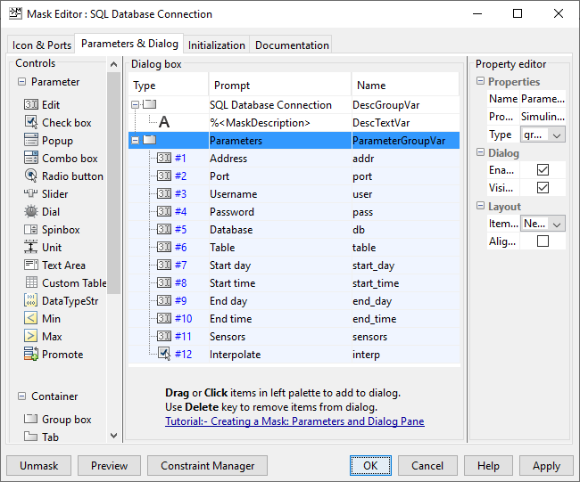

# SimDatabase
A MySQL/WebAPI(JSON) extension for Simulink.

## MySQL block





The MySQL database block connects to a MySQL server in order to request the desired output data, this is achieved by a custom CMEX S-Function written in C using the **MySQL Connector C API version 6.1.11**.

The block can interpret a predefined format of SQL entry:

| date        | time     | data                 |
|:-----------:|:--------:|:--------------------:|
| YYYY-MM-DD  | hh:mm:ss | N1=v1;N2=v2;N3=v3; … |
| ...  		    |  ...     | ...                  |       

This way a specified number of *vs* can be extracted from the database for the given *Ns* based on the time interval.

The precision required for the simulation is, currently, achieved by linear interpolation, which can be turned off.

The connection and the query take a long time compared to the other operations. To solve this problem the block saves the results in a unique file and only uses the database when this file does not exist, otherwise reads the data from the file, which takes significantly less time.

## WebAPI (JSON) block


The WebAPI (JSON) block connects to a TCP/IP server in order to request the desired output data in the form of a JSON response. The block implements a TCP/IP client and uses [DaveGamble's cJSON library](https://github.com/DaveGamble/cJSON) to parse the response.

An example of a request:
```
http://127.0.0.1/api/api.php?startDate=2019-05-
17&startTime=06:00:00&endDate=2019-05-
17&endTime=20:30:00&sensors=TW,I
```
An example of a response (if the query was successful):
```
{
    "data":[
        {
            "date":"2018-04-17",
            "time":"06:00:00",
            "TW":20.98,
            "I":53.33
        },
        {
            "date":"2018-04-17",
            "time":"06:40:00",
            "TW":21.95,
            "I":103.33
        }
    ]
}
```
An example of a response (if the query was unsuccessful):
```
{
    "error": "startTime is needed"
}
```

The precision required for the simulation is, currently, achieved by linear interpolation, which can be turned off.

The connection and the query take a long time compared to the other operations. To solve this problem the block saves the results in a unique file and only uses the database when this file does not exist, otherwise reads the data from the file, which takes significantly less time.

## Requirements
- MATLAB (>= R2018b) + Simulink (trial can do the trick)
- Visual Studio 2017 Community Edition (free)

## Compilation
Setup ```mex``` with the ```mex -setup``` command in MATLAB.
Run ```sfun/sql/compile.m``` or ```sfun/webjson/compile.m```.

## Usage
Use the database example ```example/sql/sim_test.sql``` to setup the database.
In order to use the JSON block, an example implementation of the API can be found in ```example/webjson```, it is called **api**. It uses the previously installed database scheme.

## Notes
- Compiled with MS Visual Studio 2017 Community.
- Tested on Windows 10 x64.
